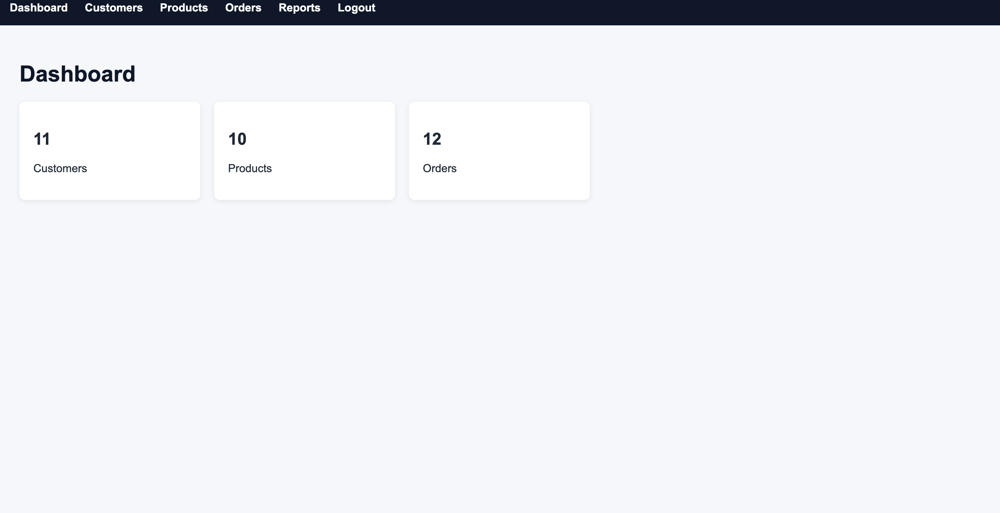
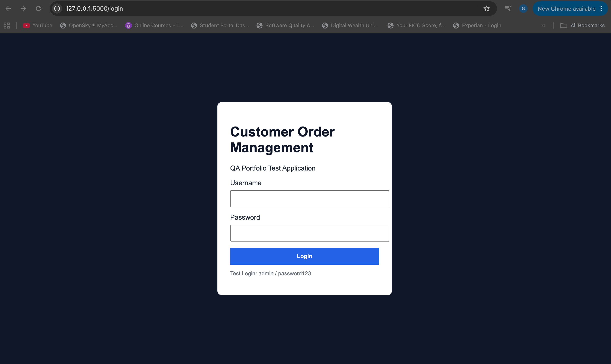
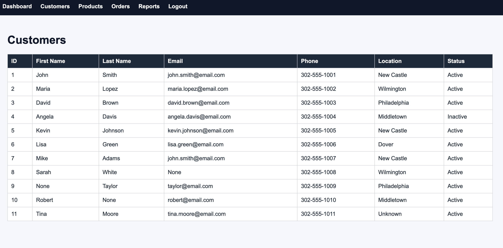
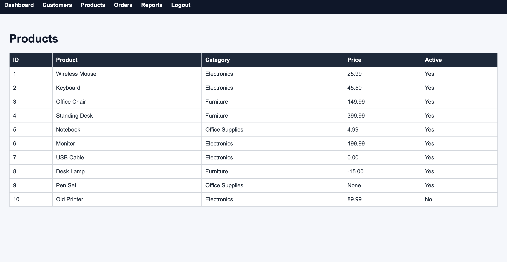
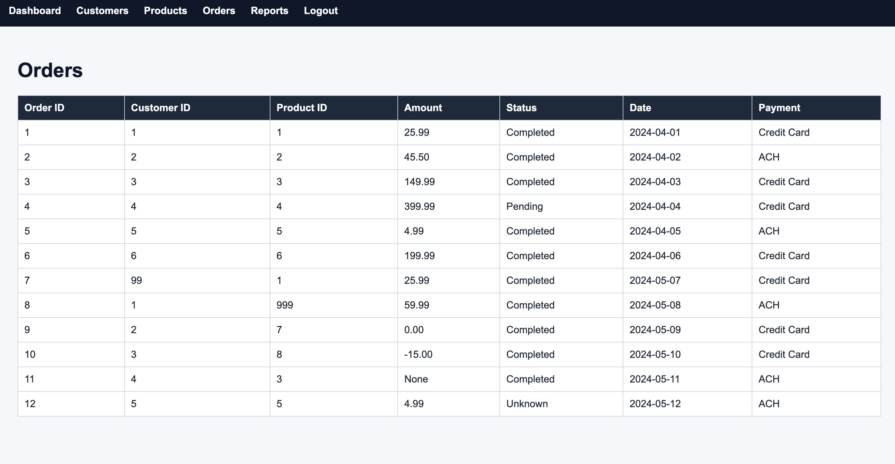
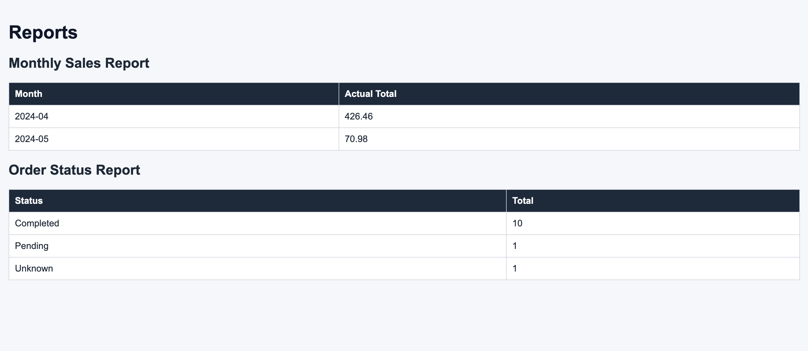

# SQL QA Data Validation Project

🚀 Demonstrating how SQL is used in Quality Assurance to validate data integrity, identify defects, verify business rules, and support backend testing.

---

## 🎯 Project Overview

This project simulates an e-commerce application and demonstrates how a QA Engineer can use SQL to validate customer, product, and order data.

### Focus Areas

✅ Data Validation

✅ Requirements Verification

✅ Business Rule Validation

✅ Defect Identification

✅ Backend Testing

✅ SQL Query Development

---

## 🛠 Skills Demonstrated

### SQL

- SELECT
- WHERE
- ORDER BY
- GROUP BY
- HAVING
- Aggregate Functions
- JOINs

### Quality Assurance

- Data Validation
- Requirements Verification
- Business Rule Validation
- Defect Identification
- UAT Support
- Root Cause Analysis

---

# Customer Order Management System QA Portfolio

## Application Under Test

### Dashboard

---

### Login

---

### Customer Management

---

### Product Management

---

### Order Management

---

### Reporting & Analytics

---

# Agile Project Management

This project follows a Scrum-based Agile workflow using Jira for backlog management, sprint planning, requirements tracking, and defect management.

## Jira Project Overview

---

## Sprint 1 Planning

---

## 📸 Project Screenshots

Screenshots will be added throughout the project to demonstrate:

- Database Schema
- Query Execution
- Query Results
- Data Validation Findings
- Defect Identification

---

## 📂 Project Structure

sql-qa-data-validation-project/

database/
- create_tables.sql
- insert_data.sql

queries/
- basic_queries.sql
- aggregate_queries.sql
- data_validation_queries.sql
- join_queries.sql

documentation/
- qa_test_scenarios.md

screenshots/

findings/

---

## 📚 Supporting Documentation

- QA Test Scenarios
- Validation Findings
- Query Library

---

## 🚀 Future Enhancements

- Advanced JOIN queries
- Subqueries
- Stored Procedures
- Additional QA validation scenarios
- Expanded defect identification examples

---

## 📌 Project Status

🟢 Active Development

This repository is part of my Quality Assurance portfolio and demonstrates how SQL can be used to support backend testing, data validation, and business rule verification.
